# Git&黑马就业数据平台-day03


## 数据可视化及ECharts体验

> [数据可视化](https://zh.wikipedia.org/wiki/数据可视化)[:](https://zh.wikipedia.org/wiki/数据可视化) 主要旨在借助于图形化手段，清晰有效地传达于沟通信息

**数据可视化--作用:**

1. 将数据转换为图形，**数据特点更加突出**，比如下图

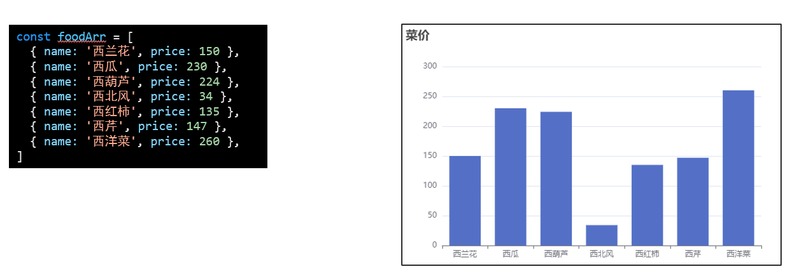

### echarts简介

[官网](https://echarts.apache.org/zh/index.html)[:](https://echarts.apache.org/zh/index.html)一个基于 JavaScript 的开源可视化图表库


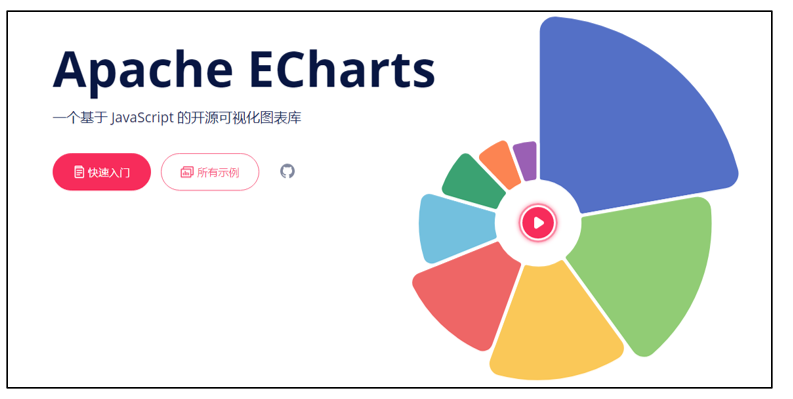

**特点:** 

1. 性能好，流畅运行于 PC 和 移动端

2. 兼容主流浏览器

3. 提供非常多的常用图表，且支持定制

4. **注意:**首页的图形除了顶部已经渲染的部分，均使用ECharts完成

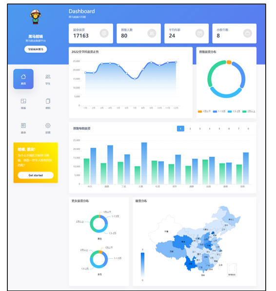

### 快速上手

需求: 基于[文档](https://echarts.apache.org/handbook/zh/get-started/)生成基础图表

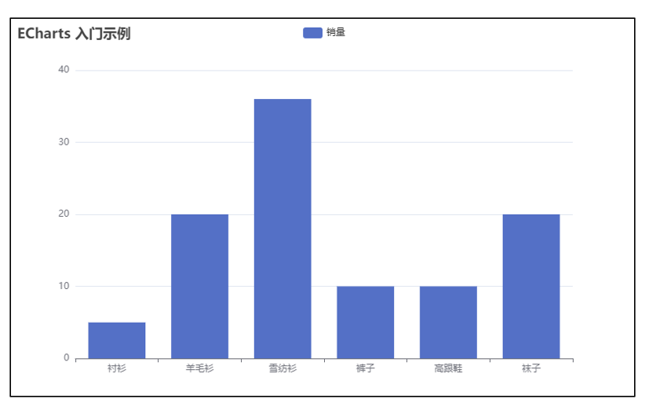

**核心步骤:**

1. 准备工作:
   1. 下包+导包
   2. 准备定义了宽高的dom容器
2. 核心代码:

```javascript
// 基于准备好的dom，初始化echarts实例
const myChart = echarts.init(document.querySelector('#main'))

// 指定图表的配置项和数据
const option = {
  // 标题
  title: {
    // 标题的文本
    text: '商品销量'
  },
  tooltip: {},
  legend: {
    data: ['销量']
  },
  xAxis: {
    data: ['衬衫', '羊毛衫', '雪纺衫', '裤子', '高跟鞋', '袜子', '西蓝花']
  },
  yAxis: {},
  series: [
    {
      name: '销量',
      type: 'bar',
      data: [5, 30, 36, 10, 10, 20, 66]
    }
  ]
}

// 使用刚指定的配置项和数据显示图表。
myChart.setOption(option)
```


## echarts基础配置

> echarts的基础配置有哪些呢？

通过不同配置项的组合，即可实现不同的图表，基础配置如下

```javascript
const option = {
  // 标题
  title: {},
  // 图例
  legend: {},  // 绘图网络
  grid: {},
  // x轴
  xAxis: {},
  // y轴
  yAxis: {},
  // 提示框
  tooltip: {},
  // 系列图表
  series: [],
  // 颜色
  color: []
}
```


**需求:**

1. 将上一节的图表调整为如下效果

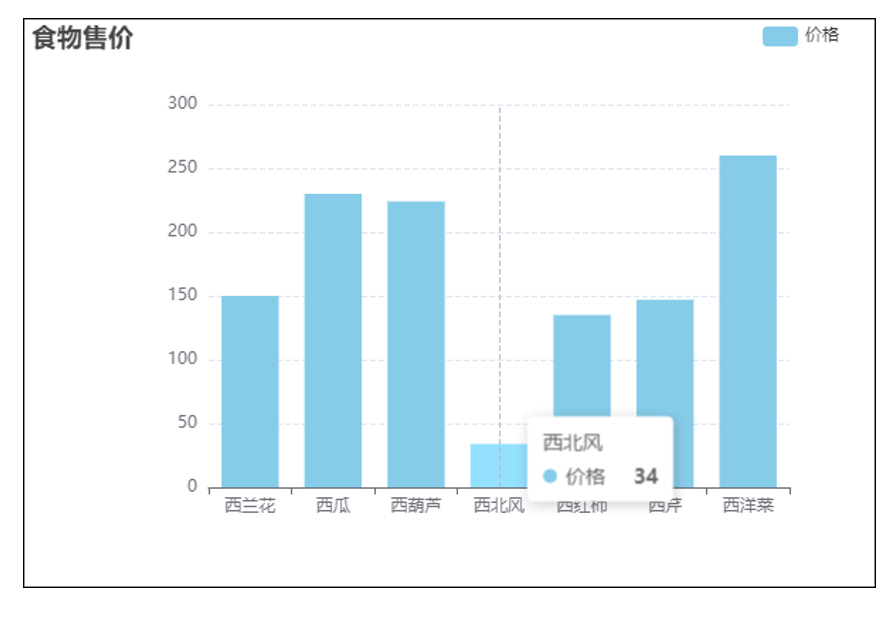


**核心步骤:**

1. 明确需求
2. 查文档--》调整配置

```html
<!DOCTYPE html>
<html lang="zh-CN">

<head>
  <meta charset="UTF-8">
  <meta http-equiv="X-UA-Compatible" content="IE=edge">
  <meta name="viewport" content="width=device-width, initial-scale=1.0">
  <style>
    #main {
      border: 1px solid #000;
    }
  </style>
  <title>Document</title>
</head>

<body>
  <!-- 为 ECharts 准备一个定义了宽高的 DOM -->
  <div id="main" style="width: 800px;height:600px;"></div>
  <!-- 下包+导包 -->
  <script src="./lib/echarts.min.js"></script>
  <script>
    // 食物数据
    const foodArr = [
      { name: '西兰花', price: 150 },
      { name: '西瓜', price: 230 },
      { name: '西葫芦', price: 224 },
      { name: '西北风', price: 34 },
      { name: '西红柿', price: 135 },
      { name: '西芹', price: 147 },
      { name: '西洋菜', price: 260 },
    ]

    // 基于准备好的dom，初始化echarts实例
    const myChart = echarts.init(document.querySelector('#main'))

    // 指定图表的配置项和数据
    const option = {
      // 标题组件
      title: {
        // 主标题文本
        text: '食物售价'
      },
      // 图例组件，可以用来切换图形的显示和隐藏
      legend: {
        // 离右侧的距离
        right: '5%',
        // 数据数组，修改内容，需要和series中的name属性对应，否则无法显示
        data: ['价格']
      },
      // 绘图网格
      grid: {
        // 离左侧容器的距离，默认10%
        left: '20%'
      },
      // 直角坐标系 grid 中的 x 轴
      xAxis: {
        // 类目数据
        data: foodArr.map(v => v.name)
        // data: ['衬衫', '羊毛衫', '雪纺衫', '裤子', '高跟鞋', '袜子', '西蓝花']
      },
      // 直角坐标系 grid 中的 y 轴
      yAxis: {
        // y轴的分割线
        splitLine: {
          // 分割线的样式
          lineStyle: {
            // 分割线的类型
            //  dashed 虚线，默认是solid 实线
            type: 'dashed'
          }
        }
      },
      // 提示框组件
      tooltip: {
        // 触发方式，默认图形
        trigger: 'axis'
      },
      // 系列列表（设置不同的图形）
      series: [
        {
          // 系列名称，tooltip,legend都会用到
          name: '价格',
          // 柱状图
          type: 'bar',
          // 系列的数据
          data: foodArr.map(v => v.price)
          // data: [5, 30, 36, 10, 10, 20, 66]
        }
      ],
      // 调色盘颜色列表
      color: ['#86cce9']
    }

    // 使用刚指定的配置项和数据显示图表。
    myChart.setOption(option)
  </script>
</body>

</html>
```


## 数据看板-函数抽取

> 方便后续编码，每一个图表对应一个函数

**需求:**

1. 首页每个区域的渲染，都抽取一个函数
2. 在`getData`中调用并通过参数传递数据


**核心步骤:**

1. 抽取函数
2. 调用并传递数据


**关键代码:**

1. `index.js`

```javascript
// 渲染顶部数据的函数
function renderOverview(overview) {
  Object.keys(overview).forEach(key => {
    // console.log(key)
    document.querySelector(`.${key}`).innerText = overview[key]
  })
}

// 首页-统计数据
async function getData() {

  // 使用拦截器的写法（只保留核心逻辑即可）
  const res = await axios({
    url: '/dashboard',
  })
  // 通过解构语法，简化数据取值
  const { overview, year, salaryData, groupData, provinceData } = res.data

  // 调用函数-渲染顶部数据
  renderOverview(overview)
}

getData()
```


**git记录:**

```bash
git add .
git commit -m"数据看板-函数抽取"
```


## 数据看板-薪资走势

> 逐步完成薪资走势

**需求:**

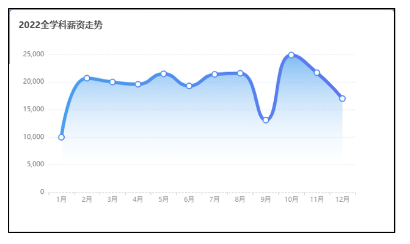


**核心步骤:**

1. [找示例](https://echarts.apache.org/examples/zh/index.html)

2. 整合到项目

3. 调整设置，依次调整:

   1. title

   2. grid

   3. yAxis

      ```javascript
      const option = {
        title: {
          text: '',// 文本
          left: '',// 左侧距离
          top: '' // 顶部距离
        },
        grid: {
          top: ''// 顶部距离
        },
        yAxis: {
          splitLine: {// 分割线
            lineStyle: {// 样式
              type: '' // 类型
            }
          },
        }
      }
      
      ```

   4. xAxis

      ```javascript
      const option = {
        xAxis: {
          axisLine: {// 轴线
            lineStyle: {// 样式
              color: '',// 颜色
              type: ''// 类型
            }
          },
          data: []// 数据
        },
      }
      
      ```

   5. series

      ```javascript
      const option = {
        series: [
          {
            data: [],// 数据
            symbolSize: '',// 标记尺寸
            lineStyle: {// 样式
              width: '',// 宽度
            },
            areaStyle: {// 区域样式
              color:''// 颜色
            },
            lineStyle: {// 线样式
              color:''// 颜色
            }
          }
        ]
      }
      ```


### 渐变色

如果要设置渐变色使用如下代码即可，关键位置见注释

```javascript
// x0, y0, x2, y2, 范围从 0 - 1，相当于在图形包围盒中的百分比
// 坐标轴如下图，原点在左上角
//  x轴: 从左往右（0-1）
//  y轴: 从上往下（0-1）
{
  type: 'linear',// 类型
  x: 0,
  y: 0,// x，y是起始点
  x2: 0,
  y2: 1,// x2，y2是结束点，从起点指向结束点就是方向
  // 如果要添加颜色，往下面数组添加即可
  colorStops: [{
      offset: 0, color: 'red' // 0% 处的颜色
  }, {
      offset: 1, color: 'blue' // 100% 处的颜色
  }],
  global: false // 缺省为 false
}

```


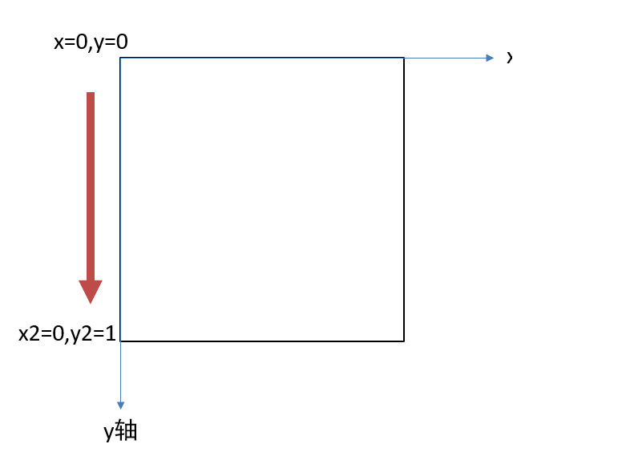


**关键代码:**

1. `index.js`

```javascript
// 渲染薪资走势
function renderYearSalary(year) {
  // console.log(year)

  // 初始化ECharts实例
  const dom = document.querySelector('#line')
  const myChart = echarts.init(dom)

  // 定义选项和数据
  const option = {
    // 标题
    title: {
      text: '2022年薪资走势',
      // left,top分别设置，距离容器左侧和顶部的距离
      left: '12',
      top: '15'
    },
    // 绘图网络
    grid: {
      top: '20%'
    },
    // y轴
    yAxis: {
      // 坐标轴类型 value，连续数据
      type: 'value',
      // 调整分割线为虚线
      splitLine: {
        lineStyle: {
          type: 'dashed'
        }
      }
    },
    // x轴
    xAxis: {
      // 坐标轴类型，类目轴
      type: 'category',
      // 坐标轴轴线相关设置
      axisLine: {
        // 线段样式
        lineStyle: {
          // 线的类型
          type: 'dashed',
          // 线的颜色，修改之后，文字也会一起变色
          color: '#ccc'
        }
      },
      // 数据
      data: year.map(v => v.month)
      // data: ['Mon', 'Tue', 'Wed', 'Thu', 'Fri', 'Sat', 'Sun']
    },
    // 系列图表
    series: [
      {
        // 数据，随机的统计数据，每次刷新图表都可能不一样
        data: year.map(v => v.salary),
        // data: [820, 932, 901, 1200, 1290, 1330, 1320],
        // 标记的大小
        symbolSize: 10,
        // 线的样式
        lineStyle: {
          // 线宽
          width: 8,
          // 颜色
          color: {
            type: 'linear',
            x: 0,
            y: 0,
            x2: 1,
            y2: 0,
            colorStops: [{
              offset: 0, color: '#479dee' // 0% 处的颜色
            }, {
              offset: 1, color: '#5c75f0' // 100% 处的颜色
            }],
            global: false // 缺省为 false
          }
        },
        // 折线图
        type: 'line',
        // 平滑曲线，true开启
        smooth: true,
        // 区域填充样式
        areaStyle: {
          // 填充颜色
          // 线性渐变，前四个参数分别是 x0, y0, x2, y2, 范围从 0 - 1，相当于在图形包围盒中的百分比，如果 globalCoord 为 `true`，则该四个值是绝对的像素位置
          color:
          {
            type: 'linear',
            x: 0,
            y: 0,
            x2: 0,
            y2: 1,
            colorStops: [{
              offset: 0, color: '#b2d7f7' // 0% 处的颜色
            }, {
              offset: 1, color: 'rgba(255,255,255,0)' // 100% 处的颜色
            }],
            global: false // 缺省为 false
          }
        }
      }
    ],
    // 提示框
    tooltip: {
      // 如果要show生效，需要设置tooltip属性，默认就是显示
      show: true, // false隐藏
      // 触发方式坐标轴
      trigger: 'axis'
    }
  }

  // 基于选项和数据绘制图表
  myChart.setOption(option)
}

// 首页-统计数据
async function getData() {

  // 使用拦截器的写法（只保留核心逻辑即可）
  const res = await axios({
    url: '/dashboard',
  })
  // const overview = res.data.overview
  // 通过解构语法，简化数据取值
  // console.log(res)
  const { overview, year, salaryData, groupData, provinceData } = res.data

  // 调用函数-渲染顶部数据
  renderOverview(overview)

  // 调用函数-渲染薪资走势
  renderYearSalary(year)
}
```


**git记录:**

```bash
git add .
git commit -m"数据看板-薪资走势"
```


## 数据看板-薪资分布

> 薪资分布

**需求:**

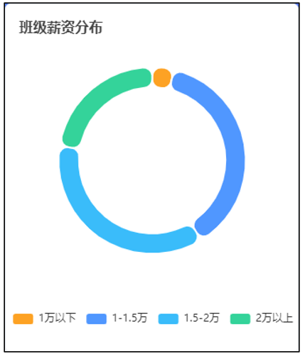

**核心步骤:**

1. [找示例](https://echarts.apache.org/examples/zh/index.html)

2. 整合到项目

3. 调整设置，依次调整:

   1. title

      ```javascript
      const option = {
        title: {
          left: '',
          top:''
        },
        series: [
          {
            name: '',// 名字，tooltip会用到
            type: '',// 类型
            radius: '',// 半径
            itemStyle:{},// 区域样式
            emphasis: {},// 高亮样式
            label: {},// 文本
            labelLine:{},// 文本引导线
            avoidLabelOverlap: '',// 避免重叠
            data:[] // 数据
          }
        ],
        color:[]// 调色盘
      }
      
      ```

      

   2. series

   3. color

**关键代码:**

1. `index.js`

```javascript
// 渲染薪资分布函数
function renderSalary(salaryData) {
  // console.log(salaryData)

  // 初始化实例
  const dom = document.querySelector('#salary')
  const myChart = echarts.init(dom)

  // 定义属性和数据
  const option = {
    title: {
      text: '班级薪资分布',
      left: 10,
      top: 15
    },
    tooltip: {
      trigger: 'item'
    },
    legend: {
      // top: '5%',
      // 离容器下侧的距离
      bottom: '5%',
      left: 'center'
    },
    series: [
      {
        name: '班级薪资分布',
        // type=pie 饼图
        type: 'pie',
        // 数组的第一项是内半径，第二项是外半径
        radius: ['55%', '70%'],
        // 图形样式
        itemStyle: {
          // 半径
          borderRadius: 15,
          // 颜色
          borderColor: '#fff',
          // 粗细
          borderWidth: 2
        },
        // 高亮状态的扇区和标签样式
        // emphasis: {
        //   label: {
        //     show: true,
        //     fontSize: 100,
        //     fontWeight: 'bold'
        //   }
        // },
        // 饼状图说明文本
        label: {
          show: false,
          // show: true,
          // position: 'center'
        },
        // 说明文本的指引线
        labelLine: {
          show: false
          // show: true
        },
        // 是否启用防止标签重叠策略，默认开启
        // avoidLabelOverlap: false,
        data: salaryData.map(v => {
          return {
            value: v.g_count + v.b_count,
            name: v.label
          }
        })
        //   [
        //   { value: 1048, name: 'Search Engine' },
        //   { value: 735, name: 'Direct' },
        //   { value: 580, name: 'Email' },
        //   { value: 484, name: 'Union Ads' },
        //   { value: 300, name: 'Video Ads' }
        // ]
      }
    ],
    // 颜色
    color: ['#fda224', '#5097ff', '#3abcfa', '#34d39a']
  }

  // 根据属性和数据绘制图表
  myChart.setOption(option)
}

// 首页-统计数据
async function getData() {

  // 使用拦截器的写法（只保留核心逻辑即可）
  const res = await axios({
    url: '/dashboard',
  })
  // const overview = res.data.overview
  // 通过解构语法，简化数据取值
  // console.log(res)
  const { overview, year, salaryData, groupData, provinceData } = res.data

  // 调用函数-渲染顶部数据
  renderOverview(overview)

  // 调用函数-渲染薪资走势
  renderYearSalary(year)
    
  // 调用函数-渲染薪资分布
  renderSalary(salaryData)

}
```


**git记录:**

```bash
git add .
git commit -m"数据看板-薪资分布"
```


## 数据看板-每组薪资

> 数据看板-每组薪资

**需求:**

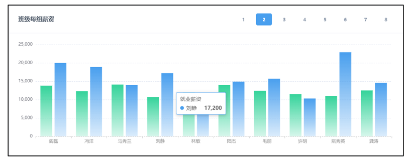

**核心步骤:**

1. [找示例](https://echarts.apache.org/examples/zh/index.html)，并调整部分设置

   ```javascript
   const option = {
     tooltip: {},// 显示提示框
     xAxis: {
       axisLine: {// 轴线样式
         lineStyle: {
           color: '',
           type: ''
         }
       }
     },
     yAxis: {
       splitLine: {// 分割线样式
         lineStyle: {
           type: ''
         }
       }
     }
   }
   
   ```

   

2. 整合到项目

3. 调整设置，依次调整:

   1. grid

   2. xAxis

      ```javascript
      const option = {
        grid: {
          left: 70,
          top: 30,
          right: 30,
          bottom: 50,
        },
        xAxis: {
          data: [],
          // 单独设置文字颜色，默认和轴线相同
          axisLabel: {
            color:'#999'
          }
        }
      }
      ```

   3. series: **提供了标准色，就用标准色**

      ```javascript
      const option = {
        series: [
          {
            name: '',
            data:[],
            itemStyle: {
              color: ''
            }
          }
        ]
      }
        // 左侧0%颜色   #34D39A
        // 左侧100%颜色 rgba(52,211,154,0.2)
        // 右侧0%颜色   #499FEE
        // 右侧100%颜色 rgba(73,159,238,0.2)
      
      ```

      

4. 切换效果: 调用`setOption`方法即可重新渲染，修改了`option`之后，图形也会随之更改

   1. 点击之后，切换高亮
   2. 获取对应组数组
   3. 调用`setOption`完成渲染


**关键代码:**

```javascript
// 渲染每组薪资函数
function renderGroupSalary(groupData) {
  // console.log(groupData)

  // 初始化实例
  const dom = document.querySelector('#lines')
  const myChart = echarts.init(dom)

  // 定义选项和数据
  const option = {
    // 显示提示框
    tooltip: {},
    // 绘图网络
    grid: {
      left: 70,
      top: 30,
      right: 30,
      bottom: 50
    },
    xAxis: {
      type: 'category',
      // data: ['Mon', 'Tue', 'Wed', 'Thu', 'Fri', 'Sat', 'Sun'],
      // 默认渲染第一组的数据
      data: groupData[1].map(v => v.name),
      // 线的类型，颜色，文字的颜色
      axisLine: {
        lineStyle: {
          color: '#ccc',
          type: 'dashed'
        }
      },
      // 坐标轴刻度标签的相关设置
      axisLabel: {
        // 刻度标签文字的颜色
        color: '#999'
      }
    },
    yAxis: {
      type: 'value',
      // 分割线的类型
      splitLine: {
        lineStyle: {
          type: 'dashed'
        }
      }
    },
    // series中设置多个图形，就会渲染多个图形
    series: [
      {
        name: '期望薪资',
        // data: [120, 200, 150, 80, 70, 110, 130],
        data: groupData[1].map(v => v.hope_salary),
        type: 'bar',
        // 柱状图的样式
        itemStyle: {
          // 柱状图的颜色
          color: {
            type: 'linear',
            x: 0,
            y: 0,
            x2: 0,
            y2: 1,
            colorStops: [{
              offset: 0, color: '#34D39A' // 0% 处的颜色
            }, {
              offset: 1, color: 'rgba(52,211,154,0.2)' // 100% 处的颜色
            }],
            global: false // 缺省为 false
          }
        }
      },
      {
        name: '实际薪资',
        // data: [120, 200, 150, 80, 70, 110, 130],
        data: groupData[1].map(v => v.salary),
        type: 'bar',
        // 柱状图的样式
        itemStyle: {
          // 柱状图的颜色
          color: {
            type: 'linear',
            x: 0,
            y: 0,
            x2: 0,
            y2: 1,
            colorStops: [{
              offset: 0, color: '#499FEE' // 0% 处的颜色
            }, {
              offset: 1, color: 'rgba(73,159,238,0.2)' // 100% 处的颜色
            }],
            global: false // 缺省为 false
          }
        }
      }
    ]
  }

  // 基于选项和数据绘制图表
  myChart.setOption(option)


  // 高亮切换
  const btns = document.querySelector('#btns')
  btns.addEventListener('click', (e) => {
    if (e.target.classList.contains('btn')) {
      // console.log('点了按钮')
      btns.querySelector('.btn-blue').classList.remove('btn-blue')
      e.target.classList.add('btn-blue')

      // 数据切换
      const index = e.target.innerText
      // console.log(index)
      const data = groupData[index]

      option.xAxis.data = data.map(v => v.name)
      option.series[0].data = data.map(v => v.hope_salary)
      option.series[1].data = data.map(v => v.salary)

      // 重新渲染
      myChart.setOption(option)
    }
  })

}

// 首页-统计数据
async function getData() {

  // 使用拦截器的写法（只保留核心逻辑即可）
  const res = await axios({
    url: '/dashboard',
  })
  // const overview = res.data.overview
  // 通过解构语法，简化数据取值
  // console.log(res)
  const { overview, year, salaryData, groupData, provinceData } = res.data

  // 调用函数-渲染顶部数据
  renderOverview(overview)

  // 调用函数-渲染薪资走势
  renderYearSalary(year)
    
  // 调用函数-渲染薪资分布
  renderSalary(salaryData)
    
  // 调用函数-渲染每组薪资
  renderGroupSalary(groupData)
}

```


**git记录:**

```bash
git add .
git commit -m"数据看板-每组薪资"
```


## 数据看板-男女薪资分布

> 数据看板-男女薪资分布

**需求:**

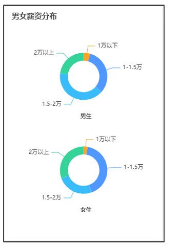

**核心步骤:**

1. [找示例](https://echarts.apache.org/examples/zh/index.html),顺表调整如下设置

   1. `legend`:隐藏图例
   2. `color`: 调色盘
   3. `title`: 通过数组设置多个标题
   4. `series`: 通过数组设置多个图

2. 整合到项目

3. 调整设置，依次调整:

   1. title: 根据提供好的位置直接设置

      ```javascript
      const option = {
        title: [
          {
            left: 10,
            top: 10,
            textStyle: {
              fontSize: 16
            }
          },
          {
            left: '50%',
            top: '45%',
            textStyle: {
              fontSize: 12
            }
          },
          {
            left: '50%',
            top: '85%',
            textStyle: {
              fontSize: 12
            }
          }
        ],
      }
      
      ```

   2. series: 根据提供好的位置和大小调整图形

      ```javascript
      const option = {
        series: [
          {
            radius: ['20%', '30%'],
            center: ['50%', '30%'],
            data: []
          },
          {
            radius: ['20%', '30%'],
            center: ['50%', '70%'],
            data: []    },
        ]
      }
      
      ```

      


**关键代码:**

1. `index.js`

```javascript
// 渲染男女薪资分布函数
function renderGenderSalary(salaryData) {
  // console.log(salaryData)

  // 初始化实例
  const dom = document.querySelector('#gender')
  const myChart = echarts.init(dom)

  // 定义选项和数据
  const option = {
    tooltip: {
      trigger: 'item'
    },
    // 不写legend 不会显示图例组件
    // legend: {
    //   top: '5%',
    //   left: 'center'
    // },
    // 颜色
    color: ['#fda224', '#5097ff', '#3abcfa', '#34d39a'],
    // 标题，通过数组设置多个
    title: [
      {
        text: '男女薪资分布',
        left: 10,
        top: 10,
        // text属性的样式
        textStyle: {
          // 文字的大小
          fontSize: 16
        }
      },
      {
        text: '男生',
        left: '50%',
        top: '45%',
        textStyle: {
          fontSize: 12
        },
        textAlign: 'center'
      },
      {
        text: '女生',
        left: '50%',
        top: '85%',
        textStyle: {
          fontSize: 12
        },
        textAlign: 'center'
      }
    ],
    series: [
      {
        type: 'pie',
        radius: ['20%', '30%'],
        // 饼图的中心（圆心）坐标，数组的第一项是横坐标，第二项是纵坐标
        center: ['50%', '30%'],
        data: salaryData.map(v => {
          return { value: v.b_count, name: v.label }
        })
        // data: [
        //   { value: 1048, name: 'Search Engine' },
        //   { value: 735, name: 'Direct' },
        //   { value: 580, name: 'Email' },
        //   { value: 484, name: 'Union Ads' },
        //   { value: 300, name: 'Video Ads' }
        // ]
      },
      {
        type: 'pie',
        radius: ['20%', '30%'],
        center: ['50%', '70%'],
        data: salaryData.map(v => {
          return { value: v.g_count, name: v.label }
        })
        // data: [
        //   { value: 1048, name: 'Search Engine' },
        //   { value: 735, name: 'Direct' },
        //   { value: 580, name: 'Email' },
        //   { value: 484, name: 'Union Ads' },
        //   { value: 300, name: 'Video Ads' }
        // ]
      }
    ]
  }

  // 基于选项和数据绘制图表
  myChart.setOption(option)
}

// 首页-统计数据
async function getData() {

  // 使用拦截器的写法（只保留核心逻辑即可）
  const res = await axios({
    url: '/dashboard',
  })
  // const overview = res.data.overview
  // 通过解构语法，简化数据取值
  // console.log(res)
  const { overview, year, salaryData, groupData, provinceData } = res.data

  // 调用函数-渲染顶部数据
  renderOverview(overview)

  // 调用函数-渲染薪资走势
  renderYearSalary(year)
    
  // 调用函数-渲染薪资分布
  renderSalary(salaryData)
    
  // 调用函数-渲染每组薪资
  renderGroupSalary(groupData)
    
  // 调用函数-渲染男女薪资分布
  renderGenderSalary(salaryData)
}
```


**git记录:**

```bash
git add .
git commit -m"数据看板-男女薪资分布"
```


## 数据看板-籍贯分布

> 数据看板-籍贯分布

**需求:**

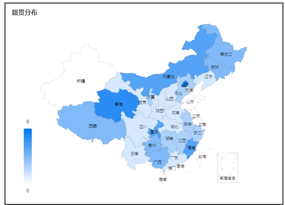

**核心步骤:**

1. 更为复杂的图形**去社区**找
   1. echarts社区：https://www.makeapie.cn/echarts
   2. 社区模板代码地址：https://www.makeapie.cn/echarts_content/xr1W9m5LOG.html
2. 整合到项目
3. 调整设置
   1. 服务器返回的是部分数据（value不为0）
   2. 循环本地数据，去服务器返回的数据中检索
   3. 找到之后将`value`设置给**对应**的数据即可

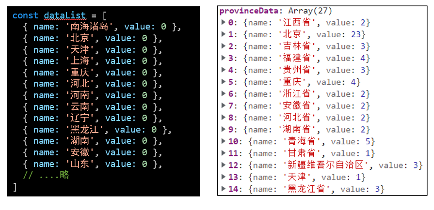


**调整好的基础模板:**

1. **移除了随机数据和多余设置**的基础代码，直接CV

```javascript
 function renderProvince(provinceData){
  const dom = document.querySelector('#map')
  const myEchart = echarts.init(dom)
  const dataList = [
    { name: '南海诸岛', value: 0 },
    { name: '北京', value: 0 },
    { name: '天津', value: 0 },
    { name: '上海', value: 0 },
    { name: '重庆', value: 0 },
    { name: '河北', value: 0 },
    { name: '河南', value: 0 },
    { name: '云南', value: 0 },
    { name: '辽宁', value: 0 },
    { name: '黑龙江', value: 0 },
    { name: '湖南', value: 0 },
    { name: '安徽', value: 0 },
    { name: '山东', value: 0 },
    { name: '新疆', value: 0 },
    { name: '江苏', value: 0 },
    { name: '浙江', value: 0 },
    { name: '江西', value: 0 },
    { name: '湖北', value: 0 },
    { name: '广西', value: 0 },
    { name: '甘肃', value: 0 },
    { name: '山西', value: 0 },
    { name: '内蒙古', value: 0 },
    { name: '陕西', value: 0 },
    { name: '吉林', value: 0 },
    { name: '福建', value: 0 },
    { name: '贵州', value: 0 },
    { name: '广东', value: 0 },
    { name: '青海', value: 0 },
    { name: '西藏', value: 0 },
    { name: '四川', value: 0 },
    { name: '宁夏', value: 0 },
    { name: '海南', value: 0 },
    { name: '台湾', value: 0 },
    { name: '香港', value: 0 },
    { name: '澳门', value: 0 },
  ]
  const option = {
    title: {
      text: '籍贯分布',
      top: 10,
      left: 10,
      textStyle: {
        fontSize: 16,
      },
    },
    tooltip: {
      trigger: 'item',
      formatter: '{b}: {c} 位学员',
      borderColor: 'transparent',
      backgroundColor: 'rgba(0,0,0,0.5)',
      textStyle: {
        color: '#fff',
      },
    },
    visualMap: {
      min: 0,
      max: 6,
      left: 'left',
      bottom: '20',
      text: ['6', '0'],
      inRange: {
        color: ['#ffffff', '#0075F0'],
      },
      show: true,
      left: 40,
    },
    geo: {
      map: 'china',
      roam: false,
      zoom: 1.0,
      label: {
        normal: {
          show: true,
          fontSize: '10',
          color: 'rgba(0,0,0,0.7)',
        },
      },
      itemStyle: {
        normal: {
          borderColor: 'rgba(0, 0, 0, 0.2)',
          color: '#e0ffff',
        },
        emphasis: {
          areaColor: '#34D39A',
          shadowOffsetX: 0,
          shadowOffsetY: 0,
          shadowBlur: 20,
          borderWidth: 0,
          shadowColor: 'rgba(0, 0, 0, 0.5)',
        },
      },
    },
    series: [
      {
        name: '籍贯分布',
        type: 'map',
        geoIndex: 0,
        data: dataList,
      },
    ],
  }
  myEchart.setOption(option)
}


```

**关键代码:**

1. `index.js`

```javascript
// 渲染籍贯分布
function renderProvince(provinceData) {
  // console.log(provinceData)
  const dom = document.querySelector('#map')
  const myEchart = echarts.init(dom)
  const dataList = [
    { name: '南海诸岛', value: 0 },
    { name: '北京', value: 0 },
    { name: '天津', value: 0 },
    { name: '上海', value: 0 },
    { name: '重庆', value: 0 },
    { name: '河北', value: 0 },
    { name: '河南', value: 0 },
    { name: '云南', value: 0 },
    { name: '辽宁', value: 0 },
    { name: '黑龙江', value: 0 },
    { name: '湖南', value: 0 },
    { name: '安徽', value: 0 },
    { name: '山东', value: 0 },
    { name: '新疆', value: 0 },
    { name: '江苏', value: 0 },
    { name: '浙江', value: 0 },
    { name: '江西', value: 0 },
    { name: '湖北', value: 0 },
    { name: '广西', value: 0 },
    { name: '甘肃', value: 0 },
    { name: '山西', value: 0 },
    { name: '内蒙古', value: 0 },
    { name: '陕西', value: 0 },
    { name: '吉林', value: 0 },
    { name: '福建', value: 0 },
    { name: '贵州', value: 0 },
    { name: '广东', value: 0 },
    { name: '青海', value: 0 },
    { name: '西藏', value: 0 },
    { name: '四川', value: 0 },
    { name: '宁夏', value: 0 },
    { name: '海南', value: 0 },
    { name: '台湾', value: 0 },
    { name: '香港', value: 0 },
    { name: '澳门', value: 0 },
  ]

  // 筛选数据
  dataList.forEach(item => {
    const res = provinceData.find(v => {
      return v.name.includes(item.name)
    })
    // console.log(res)
    // 数据赋值
    if (res !== undefined) {
      item.value = res.value
    }
  })
  // console.log(dataList)

  const option = {
    title: {
      text: '籍贯分布',
      top: 10,
      left: 10,
      textStyle: {
        fontSize: 16,
      },
    },
    tooltip: {
      trigger: 'item',
      formatter: '{b}: {c} 位学员',
      borderColor: 'transparent',
      backgroundColor: 'rgba(0,0,0,0.5)',
      textStyle: {
        color: '#fff',
      },
    },
    visualMap: {
      min: 0,
      max: 6,
      left: 'left',
      bottom: '20',
      text: ['6', '0'],
      inRange: {
        color: ['#ffffff', '#0075F0'],
      },
      show: true,
      left: 40,
    },
    geo: {
      map: 'china',
      roam: false,
      zoom: 1.0,
      label: {
        normal: {
          show: true,
          fontSize: '10',
          color: 'rgba(0,0,0,0.7)',
        },
      },
      itemStyle: {
        normal: {
          borderColor: 'rgba(0, 0, 0, 0.2)',
          color: '#e0ffff',
        },
        emphasis: {
          areaColor: '#34D39A',
          shadowOffsetX: 0,
          shadowOffsetY: 0,
          shadowBlur: 20,
          borderWidth: 0,
          shadowColor: 'rgba(0, 0, 0, 0.5)',
        },
      },
    },
    series: [
      {
        name: '籍贯分布',
        type: 'map',
        geoIndex: 0,
        data: dataList,
      },
    ],
  }
  myEchart.setOption(option)
}


// 首页-统计数据
async function getData() {

  // 使用拦截器的写法（只保留核心逻辑即可）
  const res = await axios({
    url: '/dashboard',
  })
  // const overview = res.data.overview
  // 通过解构语法，简化数据取值
  // console.log(res)
  const { overview, year, salaryData, groupData, provinceData } = res.data

  // 调用函数-渲染顶部数据
  renderOverview(overview)

  // 调用函数-渲染薪资走势
  renderYearSalary(year)
    
  // 调用函数-渲染薪资分布
  renderSalary(salaryData)
    
  // 调用函数-渲染每组薪资
  renderGroupSalary(groupData)
    
  // 调用函数-渲染男女薪资分布
  renderGenderSalary(salaryData)
    
  // 调用函数-渲染籍贯分布
  renderProvince(provinceData)
}

```


**git记录:**

```bash
git add .
git commit -m"数据看板-籍贯分布"
```

## 数据看板-代码上传

> 将代码同步到服务器

**需求:**

1. 将代码上传到**gitee**

**核心步骤:**

1. 拉取（确保进度一致）
2. 推送

```bash
git pull
git push
```


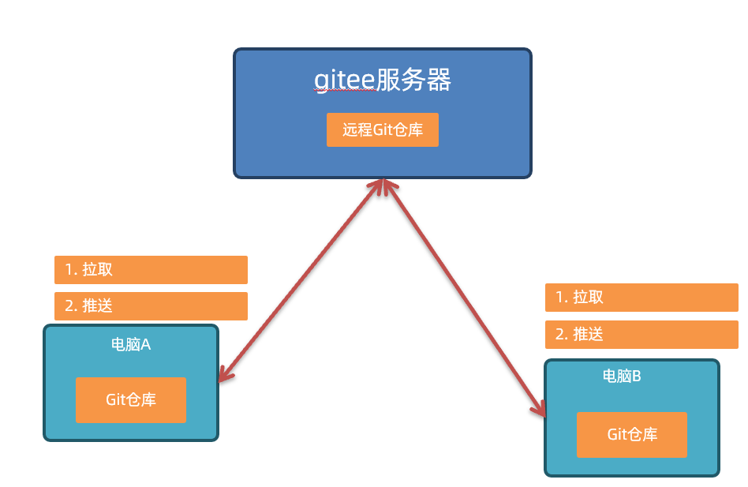